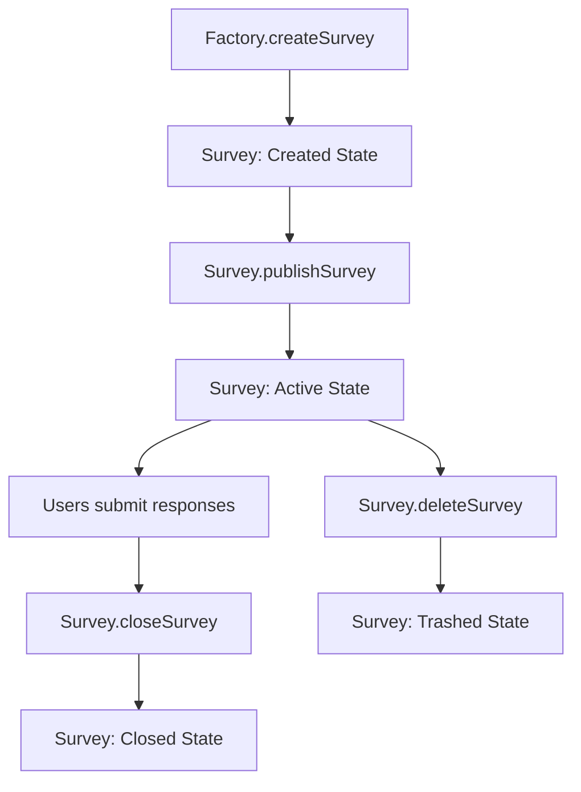

# 🔐 FHEdback Smart Contracts

This repository contains the smart contracts for FHEdback, a Confidential Survey Platform powered by Zama's FHEVM (Fully Homomorphic Encryption Virtual Machine).

## 🌟 Overview

FHEdback leverages Zama's Fully Homomorphic Encryption (FHE) technology to create a privacy-preserving survey platform that enables:

- **Complete Confidentiality**: All survey responses are encrypted and remain private
- **Statistical Analysis**: Perform computations on encrypted data without exposing individual responses
- **Zero-Knowledge Proofs**: Validate response integrity without revealing actual values
- **On-Chain Management**: Decentralized survey creation and lifecycle management

### 🏗️ Core Features:
- **Confidentiality**: All survey responses are encrypted, ensuring user privacy
- **Homomorphic Operations**: Perform statistical computations without decrypting data
- **Access Control**: Robust permission system for survey management
- **Upgradeable Architecture**: Proxy patterns for future improvements
- **Gas Optimized**: Efficient design supporting up to 15 questions and 1000 respondents

## 📋 Smart Contract Architecture

### Core Contracts

#### 🏭 **ConfidentialSurvey_Factory** 
The main factory contract that creates and manages individual survey instances.

**Key Functions:**
- `createSurvey()` - Deploy new confidential survey contracts
- `getSurveysByOwner()` - Retrieve all surveys created by a specific owner
- `totalSurveys()` - Get the total number of surveys created
- `surveys()` - Access survey by index

#### 📊 **ConfidentialSurvey**
Individual survey contract instance with full FHE capabilities.

**Key Functions:**
- `publishSurvey()` - Activate survey for response collection
- `submitResponses()` - Submit encrypted responses with ZK proofs
- `closeSurvey()` - End response collection period
- `getQuestionStatistics()` - Access encrypted statistical data
- `getRespondentStatistics()` - Access encrypted respondent data

### 🔄 Contract Lifecycle



### 📊 Survey States

```solidity
enum SurveyStatus {
    Created,    // Initial state - editable, not accepting responses
    Active,     // Published and accepting encrypted responses  
    Closed,     // Completed - no more responses, data accessible
    Trashed     // Deleted - permanently removed
}
```

## 🌐 Deployment Information

### 📋 Sepolia Testnet (VERIFIED ✅)
**Deployment Date**: September 1, 2025  
**Network**: Sepolia Testnet (Chain ID: 11155111)  
**Status**: All contracts deployed and verified

| Contract | Address | Purpose | Explorer |
|----------|---------|---------|----------|
| **ConfidentialSurvey Implementation** | [`0xb213a72EfF95D042112a13Ea749094a7624F7e6A`](https://eth-sepolia.blockscout.com/address/0xb213a72EfF95D042112a13Ea749094a7624F7e6A#code) | Survey logic template | [View Code](https://eth-sepolia.blockscout.com/address/0xb213a72EfF95D042112a13Ea749094a7624F7e6A#code) |
| **ConfidentialSurvey_Beacon** | [`0xc08F37e971a3c752c77702bf63f78bbFc2C9Bf5F`](https://eth-sepolia.blockscout.com/address/0xc08F37e971a3c752c77702bf63f78bbFc2C9Bf5F#code) | Upgrade coordination | [View Code](https://eth-sepolia.blockscout.com/address/0xc08F37e971a3c752c77702bf63f78bbFc2C9Bf5F#code) |
| **ConfidentialSurvey_Factory Implementation** | [`0xe6EB51400def6B97C5cadb1984f701F3996152f0`](https://eth-sepolia.blockscout.com/address/0xe6EB51400def6B97C5cadb1984f701F3996152f0#code) | Factory logic | [View Code](https://eth-sepolia.blockscout.com/address/0xe6EB51400def6B97C5cadb1984f701F3996152f0#code) |
| **ConfidentialSurvey_Factory Proxy** 🎯 | [`0xF5E5cdC25f7f5B7Cfd3F2d33819d4D5eA1Dc2214`](https://eth-sepolia.blockscout.com/address/0xF5E5cdC25f7f5B7Cfd3F2d33819d4D5eA1Dc2214#code) | **Main Interface** | [View Code](https://eth-sepolia.blockscout.com/address/0xF5E5cdC25f7f5B7Cfd3F2d33819d4D5eA1Dc2214#code) |
| **ProxyAdmin** | [`0x8b7bcBCee9de4134e553365499f206698A9fB434`](https://eth-sepolia.blockscout.com/address/0x8b7bcBCee9de4134e553365499f206698A9fB434#code) | Upgrade management | [View Code](https://eth-sepolia.blockscout.com/address/0x8b7bcBCee9de4134e553365499f206698A9fB434#code) |

> 🎯 **For Frontend Integration**: Use the **Factory Proxy** address `0xF5E5cdC25f7f5B7Cfd3F2d33819d4D5eA1Dc2214` to interact with the system.

> 📋 All contracts are **verified** on Sepolia Blockscout. Click the links above to view source code and interact with contracts.

Read the [deployment guide](./docs/DEPLOYMENTS.md) for detailed instructions.

## 🚀 Getting Started

### Prerequisites
- Node.js 20+ and npm 7+
- Git for version control
- Basic understanding of Solidity and Hardhat

### Installation

```bash
# Clone the repository
git clone <repository-url>
cd contracts

# Install dependencies
npm install

# Configure environment variables (interactive)
npm run setup:env

# Compile contracts and generate TypeScript types
npm run compile

# Run test suite
npm run test
```

### Environment Setup

The setup script will guide you through configuring:
- **MNEMONIC**: 12-word seed phrase for deployment wallet
- **INFURA_API_KEY**: RPC endpoint for Sepolia network  
- **ETHERSCAN_API_KEY**: For contract verification

```bash
npm run setup:env
```

Or set manually:
```bash
npx hardhat vars set MNEMONIC "your twelve word seed phrase here"
npx hardhat vars set INFURA_API_KEY "your_infura_api_key"
npx hardhat vars set ETHERSCAN_API_KEY "your_etherscan_api_key"
```

## 🧪 Testing

### Running Tests

```bash
# Run complete test suite
npm run test

# Run specific test files
npm run test -- --grep "ConfidentialSurvey"

# Generate test coverage report  
npm run coverage

# Test with gas reporting
npm run test
```

### Test Structure

```
test/
├── ConfidentialSurvey.ts              # Core survey functionality
├── ConfidentialSurvey_Factory.ts      # Factory contract tests
├── ConfidentialSurvey_Getters.ts      # Data retrieval tests
└── integration/                       # End-to-end workflow tests
```

## 🚀 Deployment

### Fresh Deployment (New Network)

```bash
# Deploy to local hardhat network
npm run deploy:local

# Deploy to Sepolia testnet (first time only)
npm run deploy:sepolia

# Deploy all components
npm run deploy
```

### Upgrading Existing Contracts

⚠️ **Important**: Only use upgrade commands if contracts are already deployed.

```bash
# Upgrade survey implementation (affects ALL existing surveys)
npm run upgrade:survey-impl:sepolia

# Upgrade factory implementation (only affects NEW surveys)
npm run upgrade:factory-impl:sepolia
```

## 🔧 Development Commands

### Contract Management
```bash
npm run clean              # Remove build artifacts
npm run compile            # Compile contracts + generate types
npm run compile:force      # Clean compile from scratch
npm run typechain          # Generate TypeScript interfaces
```

### Code Quality
```bash
npm run lint               # Run all linters (Solidity + TypeScript)
npm run lint:sol           # Solidity linting only
npm run lint:ts            # TypeScript linting only
npm run prettier:write     # Format all code
npm run prettier:check     # Check code formatting
```

### Network Operations
```bash
npm run deploy:local       # Deploy to local hardhat
npm run deploy:sepolia     # Deploy to Sepolia testnet
npm run check:env          # Validate environment setup
```

## 📚 API Reference

### Factory Contract Interface

```solidity
interface IConfidentialSurveyFactory {
    function createSurvey(
        address _owner,
        string memory _symbol,
        string memory _metadataCID,
        string memory _questionsCID, 
        uint256 _totalQuestions,
        uint256 _respondentLimit
    ) external returns (address surveyAddress);
    
    function getSurveysByOwner(address _owner) 
        external view returns (address[] memory);
        
    function totalSurveys() external view returns (uint256);
    
    function surveys(uint256 _index) external view returns (address);
}
```

### Survey Contract Interface

```solidity
interface IConfidentialSurvey {
    // Survey Management
    function publishSurvey(uint8[] calldata _maxScores) external;
    function closeSurvey() external; 
    function deleteSurvey() external;
    
    // Response Handling
    function submitResponses(
        externalEuint8[] calldata _encryptedResponses,
        bytes calldata _proofs
    ) external;
    
    // Data Access
    function getQuestionStatistics(uint256 _questionId) 
        external view returns (QuestionStats memory);
    function getRespondentStatistics(address _respondent)
        external view returns (RespondentStats memory);
    
    // Survey Info
    function survey() external view returns (SurveyDetails memory);
    function totalRespondents() external view returns (uint256);
    function hasResponded(address _user) external view returns (bool);
}
```

## 🔒 Security Features

### Access Control
- **onlyOwner**: Survey management restricted to creator
- **notOwner**: Prevents survey owners from responding to their own surveys
- **notResponded**: Ensures single response per address
- **ReentrancyGuard**: Prevents reentrancy attacks on response submission

### Gas Optimizations
- **MAX_QUESTIONS**: Limited to 15 questions per survey
- **MAX_RESPONDENTS**: Capped at 1000 respondents
- **MAX_SCORE_PER_QUESTION**: Bounded to 10 for efficient operations

### FHE Security
- **Encrypted Storage**: All responses stored as encrypted data
- **Access Control Lists**: Fine-grained decrypt permissions
- **Zero-Knowledge Proofs**: Response validation without revealing values

## 📁 Project Structure

```
contracts/
├── 📁 contracts/                    # Solidity source files
│   ├── ConfidentialSurvey.sol      # Main survey contract  
│   ├── ConfidentialSurvey_Factory.sol # Survey factory
│   └── 📁 modules/                 # Contract modules
│       ├── ConfidentialSurvey_Base.sol      # Base functionality
│       └── ConfidentialSurvey_Storage.sol   # Storage layout
├── 📁 deploy/                      # Hardhat deployment scripts
├── 📁 test/                        # Comprehensive test suites  
├── 📁 types/                       # Auto-generated TypeChain types
├── 📁 tasks/                       # Custom Hardhat tasks
├── 📁 docs/                        # Contract documentation
└── 📄 hardhat.config.ts           # Hardhat configuration
```

## 🤝 Contributing

1. **Follow Solidity Style Guide**: Use consistent naming and formatting
2. **Write Comprehensive Tests**: Ensure full coverage of new features
3. **Document Functions**: Use NatSpec comments for all public functions
4. **Gas Optimization**: Consider gas costs in implementation decisions
5. **Security First**: Follow security best practices and patterns

### Development Workflow

```bash
# 1. Create feature branch
git checkout -b feature/new-functionality

# 2. Implement changes with tests
# Write code in contracts/
# Add tests in test/

# 3. Validate changes
npm run compile
npm run test
npm run lint

# 4. Submit for review
git commit -m "feat: add new functionality"
git push origin feature/new-functionality
```

## 📄 License

This project is licensed under the **MIT License** - see the [LICENSE](LICENSE) file for details.

## 🙏 Acknowledgments

- **[Zama](https://zama.ai/)** - Fully Homomorphic Encryption technology
- **[OpenZeppelin](https://openzeppelin.com/)** - Secure smart contract patterns  
- **[Hardhat](https://hardhat.org/)** - Ethereum development environment
- **[FHEVM](https://docs.zama.ai/fhevm)** - FHE Virtual Machine implementation

---

**Built with ❤️ for privacy-preserving surveys**

## Project Structure

```
contracts/       # Solidity contracts
deploy/          # Deployment scripts
test/            # Test suites for FHE and standard questionnaires
types/           # Auto-generated TypeChain types
tasks/           # Hardhat tasks (e.g., account utilities)
```

## License
MIT License
