# FHEdback Deployment Scripts

This directory contains deployment scripts for the FHEdback confidential survey system using Hardhat Deploy.

## 🎯 What Do You Want To Do?

### If you want to **deploy everything from scratch**, do:
```bash
npm run deploy
```
This runs `01_deploy_all.ts` which deploys the complete system in one go.

### If you want to **deploy step by step** (for debugging or learning), do:
```bash
# Step 1: Deploy the survey contract template
npm run deploy:survey-impl

# Step 2: Deploy the beacon that points to the template
npm run deploy:survey-beacon  

# Step 3: Deploy the factory that creates surveys
npm run deploy:factory
```

### If you want to **update the survey contract logic** (affects all existing surveys), do:
```bash
npm run upgrade:survey-impl
```
This deploys a new survey implementation and updates the beacon.

### If you want to **update the factory contract logic** (keeps existing surveys unchanged), do:
```bash
npm run upgrade:factory-impl
```
This deploys a new factory implementation and updates the proxy.

### If you want to **test on local network first**, do:
```bash
# Start local hardhat node
npx hardhat node

# In another terminal, deploy to localhost
npm run deploy --network localhost
```

### If you want to **deploy to testnet**, do:
```bash
# Make sure you have .env configured with:
# SEPOLIA_RPC_URL=your_rpc_url
# PRIVATE_KEY=your_private_key

npm run deploy --network sepolia
```

### If you want to **verify contracts on Etherscan**, do:
```bash
# After deployment, verify each contract
npx hardhat verify --network sepolia <CONTRACT_ADDRESS>
```

## 📁 Script Details

| Script | When to Use | What It Does |
|--------|-------------|--------------|
| `01_deploy_all.ts` | First deployment or clean start | Deploys everything: implementation → beacon → factory proxy |
| `02_deploy_survey_impl.ts` | Need just the survey template | Deploys ConfidentialSurvey implementation only |
| `03_deploy_survey_beacon.ts` | Need the upgrade mechanism | Deploys beacon pointing to survey implementation |
| `04_deploy_factory.ts` | Need the survey factory | Deploys factory implementation + proxy + admin |
| `05_upgrade_survey_impl.ts` | Update survey logic | New implementation + beacon upgrade |
| `06_upgrade_factory_impl.ts` | Update factory logic | New factory implementation + proxy upgrade |

## 📋 Deployment Flow

### Initial Deployment


### Survey Creation Flow

```mermaid
graph TD
    A[Factory.createSurvey] --> B[Deploy BeaconProxy]
    B --> C[BeaconProxy → Beacon → Implementation]
    C --> D[Initialize Survey Instance]
```


## 🔧 Configuration Setup

### If you want to **deploy to a new network**, do:
1. Add network to `hardhat.config.ts`:
```typescript
networks: {
  yourNetwork: {
    url: "YOUR_RPC_URL",
    accounts: ["YOUR_PRIVATE_KEY"]
  }
}
```

2. Deploy using:
```bash
npm run deploy --network yourNetwork
```

### If you want to **use different deployer account**, do:
1. Update `namedAccounts` in `hardhat.config.ts`:
```typescript
namedAccounts: {
  deployer: {
    default: 1, // Use second account instead of first
    // or specific per network:
    mainnet: "0x1234...", // specific address
    sepolia: 2 // third account
  }
}
```

## � Common Problems & Solutions

### If you see **"Implementation not deployed"**, do:
```bash
# Deploy survey implementation first
npm run deploy:survey-impl
```

### If you see **"Beacon not found"**, do:
```bash
# Deploy beacon first
npm run deploy:survey-beacon
```

### If you see **"Factory not deployed"**, do:
```bash
# Deploy factory first  
npm run deploy:factory
```

### If you see **"Insufficient gas"**, do:
1. Check gas price:
```bash
# View current gas prices
npx hardhat console --network sepolia
> await ethers.provider.getGasPrice()
```

2. Increase gas limit in `hardhat.config.ts`:
```typescript
networks: {
  sepolia: {
    gas: 8000000, // Increase this
    gasPrice: 20000000000 // 20 gwei
  }
}
```

### If you want to **check what's deployed**, do:
```bash
# List deployment files
ls deployments/sepolia/

# Check specific contract
cat deployments/sepolia/ConfidentialSurvey.json | jq '.address'
```

### If you want to **interact with deployed contracts**, do:
```bash
# Open hardhat console
npx hardhat console --network sepolia

# Get factory instance
> const factory = await ethers.getContractAt("ConfidentialSurvey_Factory", "FACTORY_ADDRESS")

# Check factory status
> await factory.getBeacon()
> await factory.totalSurveys()

# Create a test survey
> await factory.createSurvey(
    "0x1234...", // owner
    "TEST01",    // symbol
    "QmHash123", // metadata
    "QmHash456", // questions
    5,           // scale
    100          // max respondents
  )
```

## ⚠️ Important Notes

### If you want to **upgrade survey logic**, remember:
- This affects **ALL existing surveys** immediately
- Test thoroughly on testnet first
- Consider backward compatibility

### If you want to **upgrade factory logic**, remember:
- This only affects **new surveys** created after upgrade
- Existing surveys keep using old implementation
- Much safer than survey upgrades

### If you want to **deploy to mainnet**, remember:
1. Test everything on testnet first
2. Use hardware wallet or multi-sig
3. Verify contracts on Etherscan
4. Monitor gas costs carefully
5. Consider timelock for upgrades

## 🧪 Testing & Verification

### If you want to **test deployments locally**, do:
```bash
# Start local node with pre-funded accounts
npx hardhat node

# Deploy to local network
npm run deploy --network localhost

# Run tests against deployed contracts
npm test -- --network localhost
```

### If you want to **verify deployment success**, do:
```bash
# Check all contracts deployed
npx hardhat run scripts/verify-deployment.ts --network sepolia

# Manual verification
npx hardhat console --network sepolia
> const addresses = require('./deployments/sepolia/.migrations.json')
> console.log(addresses)
```

### If you want to **monitor gas usage**, do:
```bash
# Enable gas reporting
REPORT_GAS=true npm run deploy

# Or check individual transactions
npx hardhat console --network sepolia
> const tx = await ethers.provider.getTransaction("TX_HASH")
> const receipt = await ethers.provider.getTransactionReceipt("TX_HASH")
> console.log(`Gas used: ${receipt.gasUsed}`)
```
