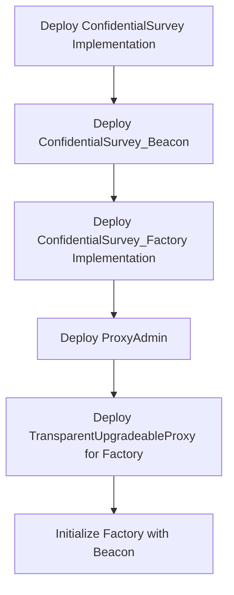
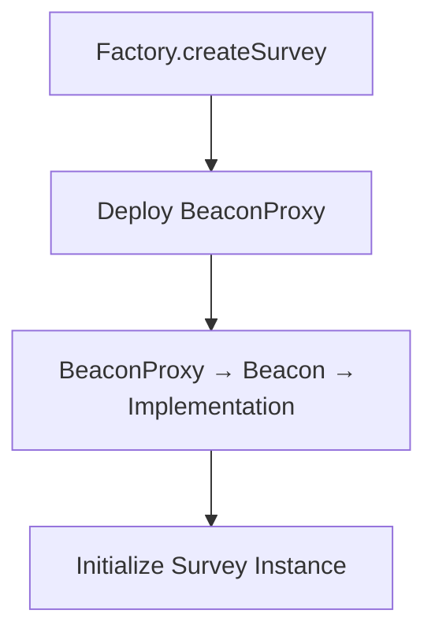

# FHEdback Deployment Scripts

This directory contains deployment scripts for the FHEdback confidential survey system using Hardhat Deploy.

## ⚠️ IMPORTANT: Read Before Deploying

### 🚨 When System Already Deployed (Production/Testnet)
**DO NOT** run full deployment commands! Use upgrade commands instead:

```bash
# ✅ SAFE: Update survey logic (affects ALL existing surveys)
npm run upgrade:survey-impl:sepolia

# ✅ SAFE: Update factory logic (only affects NEW surveys)
npm run upgrade:factory-impl:sepolia
```

### 🆕 Only for Fresh Deployment (New Network)
Use full deployment only for completely new environments:

```bash
# ⚠️ ONLY for first-time deployment on new network
npm run deploy:sepolia
```

## 🎯 Quick Commands

### 🔄 Upgrade Existing System (RECOMMENDED)
```bash
# Update survey contract logic → affects ALL existing surveys
npm run upgrade:survey-impl:local       # Local
npm run upgrade:survey-impl:sepolia     # Sepolia

# Update factory contract logic → only affects NEW surveys  
npm run upgrade:factory-impl:local      # Local
npm run upgrade:factory-impl:sepolia    # Sepolia
```

### 🆕 Fresh Deployment (New Network Only)
```bash
# Deploy everything to local hardhat network
npm run deploy:local

# Deploy everything to Sepolia (ONLY if not deployed before)
npm run deploy:sepolia

# Deploy to default network (hardhat)
npm run deploy
```

## 🎯 What Do You Want To Do?

### ⚠️ If system is **already deployed** (you have existing contracts), do:
```bash
# 🔄 UPGRADE survey logic (affects ALL existing surveys immediately)
npm run upgrade:survey-impl:local       # for local
npm run upgrade:survey-impl:sepolia     # for sepolia

# 🔄 UPGRADE factory logic (only affects NEW surveys created after upgrade)
npm run upgrade:factory-impl:local      # for local  
npm run upgrade:factory-impl:sepolia    # for sepolia
```
**⚠️ WARNING**: Survey upgrades affect ALL existing surveys. Test thoroughly!

### 🆕 If you want to **deploy everything from scratch** (new network only), do:
```bash
# Local deployment
npm run deploy:local

# Sepolia deployment (ONLY if never deployed before!)
npm run deploy:sepolia
```
**⚠️ WARNING**: This will deploy new contracts with different addresses!

### 🧪 If you want to **deploy step by step** (for debugging or learning), do:
```bash
# Step 1: Deploy the survey contract template
npm run deploy:survey-impl:local       # for local
npm run deploy:survey-impl:sepolia     # for sepolia

# Step 2: Deploy the beacon that points to the template
npm run deploy:survey-beacon:local     # for local  
npm run deploy:survey-beacon:sepolia   # for sepolia  

# Step 3: Deploy the factory that creates surveys
npm run deploy:factory:local       # for local
npm run deploy:factory:sepolia     # for sepolia
```

## 🔄 Upgrade Commands (RECOMMENDED for Existing Systems)

### 🎯 If you want to **update the survey contract logic** (affects ALL existing surveys), do:
```bash
# Local upgrade
npm run upgrade:survey-impl:local

# Sepolia upgrade  
npm run upgrade:survey-impl:sepolia
```
**⚠️ CRITICAL**: This affects **ALL existing surveys immediately**. All survey instances will use the new logic.
- ✅ **Pros**: Bug fixes and new features apply to all surveys
- ⚠️ **Cons**: Breaking changes will affect all existing surveys
- 🧪 **Recommendation**: Test thoroughly on local/testnet first

### 🎯 If you want to **update the factory contract logic** (keeps existing surveys unchanged), do:
```bash
# Local upgrade
npm run upgrade:factory-impl:local

# Sepolia upgrade
npm run upgrade:factory-impl:sepolia
```
**✅ SAFER**: This only affects **new surveys** created after upgrade.
- ✅ **Pros**: Existing surveys remain unaffected
- ✅ **Pros**: Less risky than survey implementation upgrades
- ℹ️ **Note**: Existing surveys continue using old factory logic

## 🧪 Testing Commands

### If you want to **test on local network first**, do:
```bash
# Start local hardhat node (in one terminal)
npx hardhat node

# In another terminal, deploy to localhost
npm run deploy:local

# Or use specific localhost network
npx hardhat deploy --network localhost --tags All
```

### Direct Hardhat Commands (Alternative)
```bash
# Deploy to specific networks directly
npx hardhat deploy --network hardhat --tags All      # Local
npx hardhat deploy --network sepolia --tags All      # Sepolia
npx hardhat deploy --network localhost --tags All    # Local node
```

## 🔍 Verification Commands

### If you want to **verify contracts on Etherscan**, do:
```bash
# After deployment to Sepolia, verify each contract
npx hardhat verify --network sepolia <CONTRACT_ADDRESS>

# For constructor arguments
npx hardhat verify --network sepolia <CONTRACT_ADDRESS> "arg1" "arg2"
```

## 📁 Script Details

| Script | Command | ⚠️ Risk Level | When to Use | What It Does |
|--------|---------|---------------|-------------|--------------|
| **🔄 UPGRADE COMMANDS (Recommended)** |
| `05_upgrade_survey_impl.ts` | `npm run upgrade:survey-impl:local` <br> `npm run upgrade:survey-impl:sepolia` | 🔴 **HIGH RISK** <br> Affects ALL surveys | Update survey logic/fix bugs | New implementation + beacon upgrade |
| `06_upgrade_factory_impl.ts` | `npm run upgrade:factory-impl:local` <br> `npm run upgrade:factory-impl:sepolia` | 🟡 **LOW RISK** <br> Only new surveys | Update factory logic | New factory implementation + proxy upgrade |
| **🆕 FRESH DEPLOYMENT (New Networks Only)** |
| `01_deploy_all.ts` | `npm run deploy:local` <br> `npm run deploy:sepolia` | 🟢 **SAFE** <br> New addresses | First deployment or clean start | Deploys everything: implementation → beacon → factory proxy |
| **🧪 STEP-BY-STEP DEPLOYMENT (Debug Only)** |
| `02_deploy_survey_impl.ts` | `npm run deploy:survey-impl:local` <br> `npm run deploy:survey-impl:sepolia` | 🟢 **SAFE** <br> New contracts | Need just the survey template | Deploys ConfidentialSurvey implementation only |
| `03_deploy_survey_beacon.ts` | `npm run deploy:survey-beacon:local` <br> `npm run deploy:survey-beacon:sepolia` | 🟢 **SAFE** <br> New contracts | Need the upgrade mechanism | Deploys beacon pointing to survey implementation |
| `04_deploy_factory.ts` | `npm run deploy:factory:local` <br> `npm run deploy:factory:sepolia` | 🟢 **SAFE** <br> New contracts | Need the survey factory | Deploys factory implementation + proxy + admin |

## 📋 Deployment Flow

### Initial Deployment


### Survey Creation Flow


## 🔧 Configuration Setup

### If you want to **deploy to a new network**, do:
1. Add network to `hardhat.config.ts`:
```typescript
networks: {
  yourNetwork: {
    url: "YOUR_RPC_URL",
    accounts: ["YOUR_PRIVATE_KEY"]
  }
}
```

2. Deploy using:
```bash
npm run deploy --network yourNetwork
```

### If you want to **use different deployer account**, do:
1. Update `namedAccounts` in `hardhat.config.ts`:
```typescript
namedAccounts: {
  deployer: {
    default: 1, // Use second account instead of first
    // or specific per network:
    mainnet: "0x1234...", // specific address
    sepolia: 2 // third account
  }
}
```

## � Common Problems & Solutions

### If you see **"Implementation not deployed"**, do:
```bash
# Deploy survey implementation first
npm run deploy:survey-impl
```

### If you see **"Beacon not found"**, do:
```bash
# Deploy beacon first
npm run deploy:survey-beacon
```

### If you see **"Factory not deployed"**, do:
```bash
# Deploy factory first  
npm run deploy:factory
```

### If you see **"Insufficient gas"**, do:
1. Check gas price:
```bash
# View current gas prices
npx hardhat console --network sepolia
> await ethers.provider.getGasPrice()
```

2. Increase gas limit in `hardhat.config.ts`:
```typescript
networks: {
  sepolia: {
    gas: 8000000, // Increase this
    gasPrice: 20000000000 // 20 gwei
  }
}
```

### If you want to **check what's deployed**, do:
```bash
# List deployment files
ls deployments/sepolia/

# Check specific contract
cat deployments/sepolia/ConfidentialSurvey.json | jq '.address'
```

### If you want to **interact with deployed contracts**, do:
```bash
# Open hardhat console
npx hardhat console --network sepolia

# Get factory instance
> const factory = await ethers.getContractAt("ConfidentialSurvey_Factory", "FACTORY_ADDRESS")

# Check factory status
> await factory.getBeacon()
> await factory.totalSurveys()

# Create a test survey
> await factory.createSurvey(
    "0x1234...", // owner
    "TEST01",    // symbol
    "QmHash123", // metadata
    "QmHash456", // questions
    5,           // scale
    100          // max respondents
  )
```

## ⚠️ Important Notes

### 🚨 **CRITICAL: Before Any Upgrade**
1. **Survey Implementation Upgrades** (`upgrade:survey-impl`):
   - ⚠️ **AFFECTS ALL EXISTING SURVEYS IMMEDIATELY**
   - 🧪 Test on local network first: `npm run upgrade:survey-impl:local`
   - 🧪 Test on testnet before mainnet
   - 📋 Consider backward compatibility with existing survey data
   - 🔄 Have rollback plan ready

2. **Factory Implementation Upgrades** (`upgrade:factory-impl`):
   - ✅ **ONLY AFFECTS NEW SURVEYS** created after upgrade
   - ✅ Much safer than survey upgrades
   - ✅ Existing surveys continue working normally
   - 🔄 Can upgrade factory logic without disrupting users

### 🎯 **When System Already Deployed (Has Contract Addresses)**
```bash
# ✅ RECOMMENDED: Use upgrade commands
npm run upgrade:survey-impl:sepolia     # Update survey logic
npm run upgrade:factory-impl:sepolia    # Update factory logic

# ❌ AVOID: Full deployment (creates new addresses)
npm run deploy:sepolia                  # DON'T do this!
```

### 🆕 **When Deploying to New Network (No Existing Contracts)**
```bash
# ✅ CORRECT: Use fresh deployment
npm run deploy:sepolia                  # First time on new network

# ❌ WRONG: Upgrade commands won't work
npm run upgrade:survey-impl:sepolia     # No existing contracts to upgrade!
```

### 🔄 **Understanding the Proxy Pattern**
- **Proxy Contracts** (`Factory Proxy`, `Beacon`, `ProxyAdmin`): 
  - ✅ **Addresses NEVER change**
  - ✅ **State/data preserved**
  - ✅ **Users/frontend keep same addresses**
  
- **Implementation Contracts** (`Survey Impl`, `Factory Impl`):
  - 🔄 **Can be upgraded**
  - 📝 **Contains the business logic**
  - ⚠️ **Survey impl changes affect ALL surveys**
  - ✅ **Factory impl changes only affect NEW surveys**

## 🧪 Testing & Verification

### If you want to **test deployments locally**, do:
```bash
# Start local node with pre-funded accounts
npx hardhat node

# Deploy to local network
npm run deploy --network localhost

# Run tests against deployed contracts
npm test -- --network localhost
```

### If you want to **verify deployment success**, do:
```bash
# Check all contracts deployed
npx hardhat run scripts/verify-deployment.ts --network sepolia

# Manual verification
npx hardhat console --network sepolia
> const addresses = require('./deployments/sepolia/.migrations.json')
> console.log(addresses)
```

### If you want to **monitor gas usage**, do:
```bash
# Enable gas reporting
REPORT_GAS=true npm run deploy

# Or check individual transactions
npx hardhat console --network sepolia
> const tx = await ethers.provider.getTransaction("TX_HASH")
> const receipt = await ethers.provider.getTransactionReceipt("TX_HASH")
> console.log(`Gas used: ${receipt.gasUsed}`)
```

## 📋 Pre-Deployment Checklist

### ⚠️ Before Any Upgrade (Existing System):
- [ ] ✅ Confirm system is already deployed (check contract addresses in README.md)
- [ ] 🧪 Test upgrade on local network first: `npm run upgrade:*:local`
- [ ] 📋 Review all changes in implementation contracts
- [ ] ⚠️ **Critical**: Survey upgrades affect ALL existing surveys immediately
- [ ] 🔄 Prepare rollback plan (keep previous implementation address)
- [ ] 📝 Document what's being changed and why
- [ ] 🔐 Verify deployer has upgrade permissions

### 🆕 Before Fresh Deployment (New Network):
- [ ] ✅ Confirm this is a NEW network (no existing contracts)
- [ ] 🔧 Check network configuration in `hardhat.config.ts`
- [ ] 💰 Ensure sufficient ETH for gas costs
- [ ] 🔑 Verify deployer account has proper permissions
- [ ] 📝 Plan contract verification strategy (Etherscan/Blockscout)
- [ ] 🧪 Test deployment on local network first

### 🚀 Additional for Mainnet:
- [ ] 🔐 Use hardware wallet or multi-sig for deployer
- [ ] 🧪 Deploy and test on all testnets first
- [ ] ⏰ Consider timelock for future upgrades
- [ ] 📊 Monitor gas prices and deploy during low congestion
- [ ] 🔍 Plan post-deployment verification and monitoring
