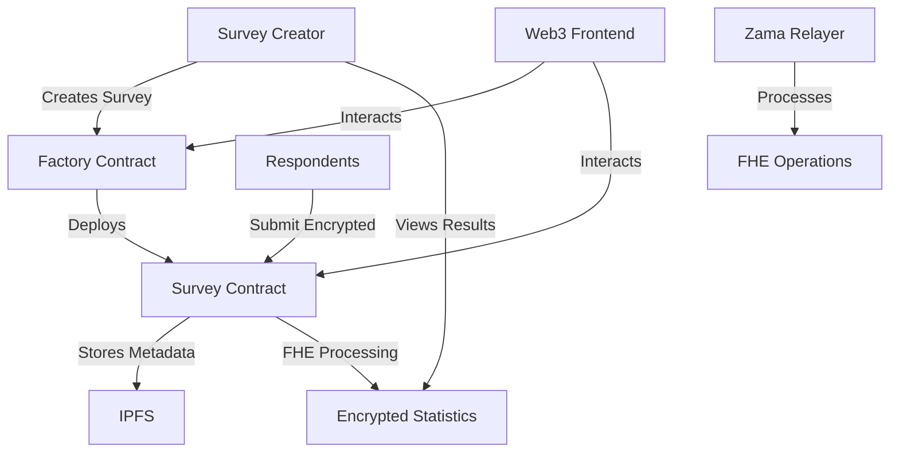

# 🔐 FHEdback - Confidential Survey Platform

> A privacy-first survey platform built with **Fully Homomorphic Encryption (FHE)** using Zama's FHEVM, enabling completely confidential surveys where individual responses remain encrypted while allowing statistical analysis.

[](LICENSE)
[](https://docs.soliditylang.org/)
[](https://reactjs.org/)
[](https://www.typescriptlang.org/)

## 🌟 Features

- **� Fully Homomorphic Encryption**: Individual responses remain encrypted while enabling statistical computations
- **📊 Confidential Analytics**: Survey creators can view aggregated statistics without accessing individual responses  
- **🚀 Zero-Knowledge Proofs**: Response validity verified without revealing actual values
- **🎯 On-Chain Survey Management**: Decentralized survey creation, publication, and lifecycle management
- **📱 Modern Web Interface**: Intuitive React-based frontend with real-time blockchain integration
- **🌐 IPFS Storage**: Distributed storage for survey metadata and questions
- **🔄 Upgradeable Contracts**: Proxy pattern allows for secure contract updates

## 🏗️ Architecture Overview



## 📁 Project Structure

```
fhedback/
├── 📁 frontend/                 # React Frontend Application
│   ├── 📁 src/
│   │   ├── 📁 components/      # Reusable UI components
│   │   ├── 📁 routes/          # Application routes (TanStack Router)
│   │   ├── 📁 services/        # Web3 and API services
│   │   ├── 📁 hooks/           # Custom React hooks
│   │   ├── 📁 types/           # TypeScript type definitions
│   │   └── 📁 utils/           # Utility functions
│   ├── 📁 public/              # Static assets
│   └── 📁 docs/                # Frontend documentation
├── 📁 contracts/               # Smart Contracts & Deployment
│   ├── 📁 contracts/           # Solidity contracts
│   │   ├── ConfidentialSurvey.sol       # Main survey contract
│   │   ├── ConfidentialSurvey_Factory.sol # Factory for creating surveys
│   │   └── 📁 modules/         # Contract modules and libraries
│   ├── 📁 deploy/              # Hardhat deployment scripts
│   ├── 📁 test/                # Contract test suites
│   └── 📁 docs/                # Contract documentation
└── 📄 README.md                # This file
```

## 🚀 Quick Start

### Prerequisites

- **Node.js** 20+ and npm 7+
- **Git** for version control
- **MetaMask** or compatible Web3 wallet
- **Sepolia ETH** for testnet deployment

### 1. Clone Repository

```bash
git clone https://github.com/your-username/fhedback.git
cd fhedback
```

### 2. Frontend Setup

```bash
cd frontend
npm install
cp .env.example .env.local
```

Edit `.env.local` with your configuration:

```bash
# Required: Wallet Connect Project ID
VITE_WALLETCONNECT_PROJECT_ID=your_project_id

# Required: IPFS Storage (Pinata)
VITE_PINATA_JWT=your_pinata_jwt
VITE_PINATA_GATEWAY_URL=https://gateway.pinata.cloud

# Network Configuration
VITE_ZAMA_TESTNET_RPC=https://devnet.zama.ai
```

Start development server:

```bash
npm run dev
```

### 3. Smart Contracts Setup

```bash
cd ../contracts
npm install
```

**Configure environment variables:**

```bash
# Run setup script for interactive configuration
npm run setup:env

# Or manually set variables:
npx hardhat vars set MNEMONIC "your twelve word mnemonic phrase here"
npx hardhat vars set INFURA_API_KEY "your_infura_key"
npx hardhat vars set ETHERSCAN_API_KEY "your_etherscan_key"
```

**Compile and test contracts:**

```bash
# Compile contracts and generate TypeScript types
npm run compile

# Run test suite
npm run test

# Deploy to local network
npm run deploy:local

# Deploy to Sepolia (if not already deployed)
npm run deploy:sepolia
```

## 🎯 Core Workflow

### 1. Survey Creation Flow

```typescript
// 1. Creator designs survey with metadata and questions
const surveyData = {
  title: "Product Feedback Survey",
  questions: [...],
  respondentLimit: 100
}

// 2. Frontend uploads to IPFS
const metadataCID = await uploadToIPFS(metadata)
const questionsCID = await uploadToIPFS(questions)

// 3. Factory creates new survey contract
await factory.createSurvey(
  owner,
  symbol,
  metadataCID,
  questionsCID,
  totalQuestions,
  respondentLimit
)

// 4. Survey published with max scores for each question
await survey.publishSurvey([5, 5, 5]) // max scores per question
```

### 2. Response Submission Flow

```typescript
// 1. Respondent connects wallet and loads survey
const survey = await loadSurveyData(surveyAddress)

// 2. Answers are encrypted client-side
const encryptedResponses = await encryptResponses([4, 3, 5])

// 3. Submit with zero-knowledge proofs
await survey.submitResponses(encryptedResponses, proofs)

// 4. Statistics updated homomorphically (no decryption)
```

### 3. Results Analysis Flow

```typescript
// 1. Survey owner can view aggregated statistics
const stats = await survey.getQuestionStatistics(questionIndex)

// 2. Decrypt aggregated values (not individual responses)
const totalSum = await decrypt(stats.total)
const respondentCount = await survey.totalRespondents()
const average = totalSum / respondentCount
```

## 📋 Smart Contract Details

### Core Contracts

#### **ConfidentialSurvey_Factory**
- **Address**: `0xF5E5cdC25f7f5B7Cfd3F2d33819d4D5eA1Dc2214` (Sepolia)
- **Purpose**: Creates and manages survey contracts
- **Key Functions**:
  - `createSurvey()` - Deploy new survey
  - `getSurveysByOwner()` - List user's surveys
  - `totalSurveys()` - Get total survey count

#### **ConfidentialSurvey**
- **Purpose**: Individual survey instance with FHE capabilities
- **Key Functions**:
  - `publishSurvey()` - Activate survey for responses
  - `submitResponses()` - Submit encrypted responses
  - `closeSurvey()` - End response collection
  - `getQuestionStatistics()` - Access encrypted analytics

### Contract States

```solidity
enum SurveyStatus {
    Created,    // Initial state, can be edited
    Active,     // Published, accepting responses
    Closed,     // Completed, no more responses
    Trashed     // Deleted
}
```

### Security Features

- **Access Control**: Only survey owners can manage their surveys
- **Homomorphic Operations**: FHE enables computation on encrypted data
- **Gas Optimization**: Limited to 15 questions and 1000 respondents
- **Proxy Pattern**: Upgradeable contracts via OpenZeppelin proxies
- **Reentrancy Protection**: SafeGuards against common attack vectors

## 🛠️ Development

### Frontend Development

**Tech Stack:**
- React 19 with TypeScript
- TanStack Router for routing
- Wagmi + Viem for Web3 integration  
- TailwindCSS + Radix UI for styling
- React Hook Form + Zod for forms
- TanStack Query for data fetching

**Key Commands:**
```bash
npm run dev          # Start dev server
npm run build        # Production build  
npm run lint         # Run ESLint
npm run type-check   # TypeScript validation
```

### Smart Contract Development

**Tech Stack:**
- Solidity 0.8.24
- Hardhat for development
- FHEVM for homomorphic encryption
- OpenZeppelin contracts
- TypeChain for type generation

**Key Commands:**
```bash
npm run compile      # Compile contracts
npm run test         # Run test suite
npm run coverage     # Test coverage
npm run deploy       # Deploy contracts
```

## 🌐 Deployed Contracts (Sepolia)

All contracts are **verified** on [Sepolia Blockscout](https://eth-sepolia.blockscout.com/):

| Contract | Address | Purpose |
|----------|---------|---------|
| **Factory Proxy** 🎯 | [`0xF5E5cdC25f7f5B7Cfd3F2d33819d4D5eA1Dc2214`](https://eth-sepolia.blockscout.com/address/0xF5E5cdC25f7f5B7Cfd3F2d33819d4D5eA1Dc2214#code) | Main interface for creating surveys |
| Survey Implementation | [`0xb213a72EfF95D042112a13Ea749094a7624F7e6A`](https://eth-sepolia.blockscout.com/address/0xb213a72EfF95D042112a13Ea749094a7624F7e6A#code) | Survey logic template |
| Factory Implementation | [`0xe6EB51400def6B97C5cadb1984f701F3996152f0`](https://eth-sepolia.blockscout.com/address/0xe6EB51400def6B97C5cadb1984f701F3996152f0#code) | Factory logic |
| Beacon Contract | [`0xc08F37e971a3c752c77702bf63f78bbFc2C9Bf5F`](https://eth-sepolia.blockscout.com/address/0xc08F37e971a3c752c77702bf63f78bbFc2C9Bf5F#code) | Upgrade coordination |
| ProxyAdmin | [`0x8b7bcBCee9de4134e553365499f206698A9fB434`](https://eth-sepolia.blockscout.com/address/0x8b7bcBCee9de4134e553365499f206698A9fB434#code) | Upgrade management |

> 🎯 **For integration**: Use Factory Proxy address `0xF5E5cdC25f7f5B7Cfd3F2d33819d4D5eA1Dc2214`

## 🧪 Testing

### Contract Testing

```bash
cd contracts
npm run test                    # Run all tests
npm run test -- --grep "Survey" # Run specific tests
npm run coverage               # Generate coverage report
```

### Frontend Testing

```bash
cd frontend
npm run test                   # Run unit tests
npm run test:integration      # Run integration tests
```

### Manual Testing

1. **Create Survey**: Use `/creator/new` to create a test survey
2. **Respond to Survey**: Visit `/survey/{id}` to submit responses  
3. **View Results**: Check `/survey/{id}/results` for analytics
4. **Manage Surveys**: Use `/creator` dashboard

## 🔄 Deployment & Upgrades

### Fresh Deployment (New Network)

```bash
cd contracts
npm run deploy:sepolia         # Deploy all contracts
```

### Upgrading Existing Deployment

```bash
# Upgrade survey logic (affects ALL existing surveys)
npm run upgrade:survey-impl:sepolia

# Upgrade factory logic (only affects NEW surveys)  
npm run upgrade:factory-impl:sepolia
```

⚠️ **Warning**: Survey upgrades affect all existing surveys immediately. Test thoroughly on local/testnet first.

## 📚 API Reference

### Survey Factory Contract

```typescript
interface IConfidentialSurveyFactory {
  function createSurvey(
    address owner,
    string memory symbol,
    string memory metadataCID,
    string memory questionsCID,
    uint256 totalQuestions,
    uint256 respondentLimit
  ) external returns (address);
  
  function getSurveysByOwner(address owner) external view returns (address[]);
  function totalSurveys() external view returns (uint256);
}
```

### Survey Contract

```typescript
interface IConfidentialSurvey {
  function publishSurvey(uint8[] calldata maxScores) external;
  function submitResponses(
    externalEuint8[] calldata encryptedResponses,
    bytes calldata proofs
  ) external;
  function closeSurvey() external;
  function getQuestionStatistics(uint256 questionId) external view;
}
```

## 🤝 Contributing

1. **Fork the repository**
2. **Create a feature branch**: `git checkout -b feature/amazing-feature`
3. **Follow code style**: Run `npm run lint` and `npm run format`
4. **Add tests**: Ensure good test coverage
5. **Commit changes**: Use conventional commits
6. **Push to branch**: `git push origin feature/amazing-feature`  
7. **Open a Pull Request**

### Development Guidelines

- Use TypeScript strictly
- Follow established folder structure
- Write tests for new features
- Update documentation for significant changes
- Ensure contracts are gas-optimized

## 🔒 Security Considerations

- **FHE Limitations**: Currently supports basic arithmetic on encrypted data
- **Gas Limits**: Maximum 15 questions and 1000 respondents per survey
- **Access Control**: Proper owner validation on all admin functions
- **Upgrades**: Use upgrade patterns carefully in production
- **Testing**: Comprehensive test coverage before mainnet deployment

## 📄 License

This project is licensed under the **MIT License** - see the [LICENSE](LICENSE) file for details.

## 🆘 Support

- **Documentation**: Check the `docs/` folders in each package
- **Issues**: Open GitHub issues for bugs or feature requests
- **Discussions**: Use GitHub Discussions for questions
- **Contact**: [Your Contact Information]

## 🙏 Acknowledgments

- [Zama](https://zama.ai/) for FHEVM and homomorphic encryption
- [OpenZeppelin](https://openzeppelin.com/) for secure contract patterns
- [Hardhat](https://hardhat.org/) for development framework
- [TanStack](https://tanstack.com/) for modern React tooling

---

**Built with ❤️ by the FHEdback Team**
import { useQuery } from '@tanstack/react-query';

// 2. Internal imports (components, hooks, utils)
import { Button } from '@/components/ui';
import { useWallet } from '@/hooks';
import { cn } from '@/utils';

// 3. Types
import type { Survey } from '@/types';
```

## 🧪 Testing

- **Unit Tests**: Test individual components and functions
- **Integration Tests**: Test component interactions
- **E2E Tests**: Test complete user workflows

```bash
npm run test          # Run all tests
npm run test:unit     # Run unit tests only
npm run test:integration # Run integration tests only
```

## 📦 Tech Stack

### Frontend
- **React 19** - UI library
- **TypeScript** - Type safety
- **Vite 7** - Build tool and dev server
- **TanStack Router** - Type-safe routing
- **TailwindCSS v4** - Styling framework

### UI Components
- **Radix UI** - Headless UI primitives
- **Lucide React** - Icon library
- **Class Variance Authority** - Component variants
- **React Hook Form** - Form handling
- **Zod** - Schema validation

### Blockchain & Privacy
- **Wagmi** - React hooks for Ethereum
- **Viem** - TypeScript interface for Ethereum
- **Ethers.js** - Ethereum library
- **Zama FHE Relayer SDK** - Fully Homomorphic Encryption
- **RainbowKit** - Wallet connection

### Data & Storage
- **TanStack Query** - Data fetching and caching
- **Pinata** - IPFS file storage
- **Recharts** - Data visualization

## 🔧 Configuration

### Environment Variables
Copy `.env.example` to `.env.local` and configure:

```env
# App Configuration
VITE_APP_NAME=FhedBack
VITE_APP_VERSION=1.0.0

# Blockchain
VITE_ZAMA_TESTNET_RPC=https://devnet.zama.ai
VITE_WALLETCONNECT_PROJECT_ID=your_project_id

# IPFS
VITE_PINATA_JWT=your_pinata_jwt
VITE_PINATA_GATEWAY_URL=https://gateway.pinata.cloud
```

### VS Code Setup
Recommended extensions are automatically suggested. The workspace includes:
- TypeScript support
- TailwindCSS IntelliSense
- ESLint integration
- Prettier formatting
- Auto imports

## 📝 Scripts

- `npm run dev` - Start development server
- `npm run build` - Build for production
- `npm run preview` - Preview production build
- `npm run lint` - Run ESLint
- `scripts/setup.sh` - Development environment setup
- `scripts/build.sh` - Production build script

## 🤝 Contributing

1. Follow the established folder structure
2. Write tests for new features
3. Use TypeScript strictly
4. Follow the import organization guidelines
5. Update documentation for significant changes

## 📄 License

This project is licensed under the MIT License.

## 🆘 Support

For development questions, check the `docs/` folder or create an issue.
