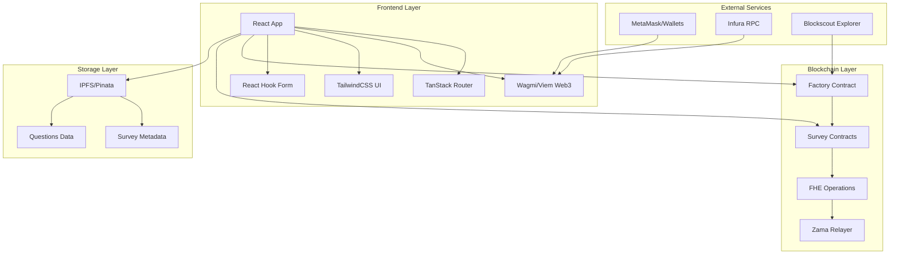
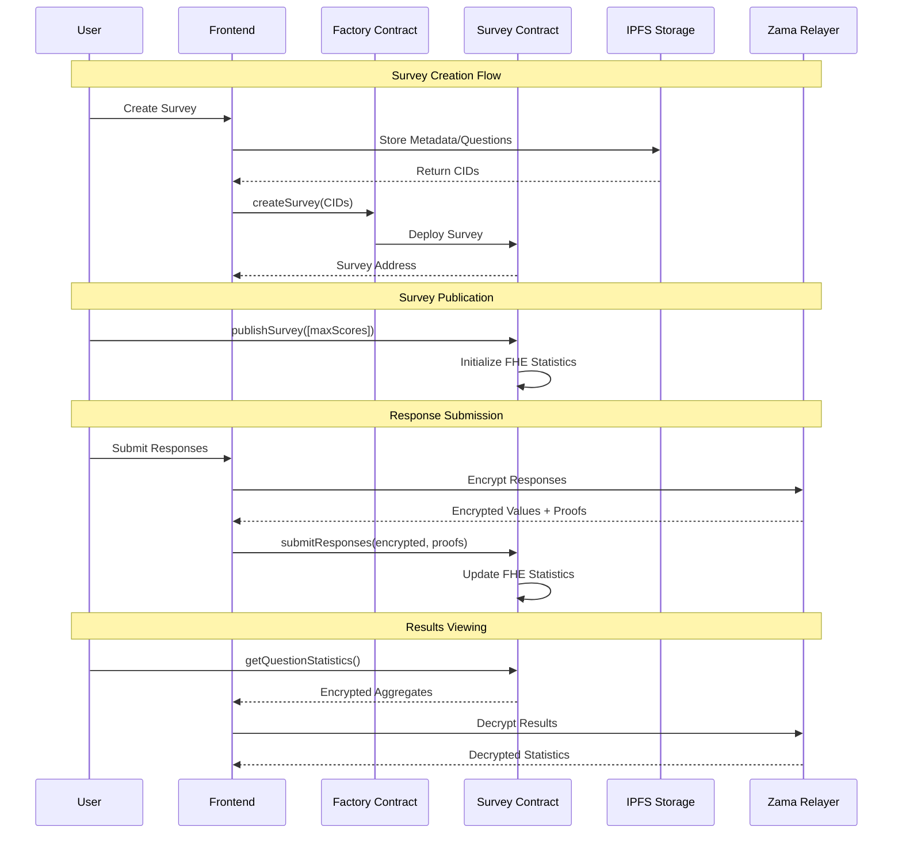
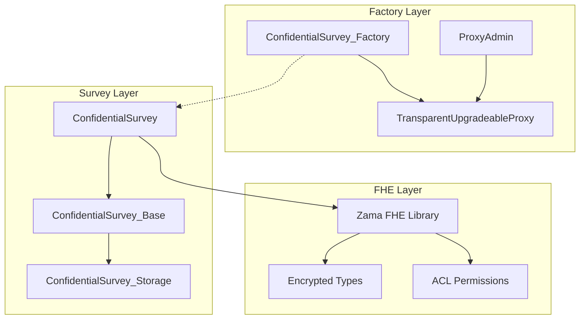

# 🏗️ FHEdback Architecture Documentation

## 🌐 System Overview

FHEdback is a privacy-first survey platform that leverages **Fully Homomorphic Encryption (FHE)** to enable confidential surveys where individual responses remain encrypted while still allowing statistical analysis. The system is built on Zama's FHEVM (Fully Homomorphic Encryption Virtual Machine) running on Ethereum's Sepolia testnet.

## 🔧 Core Architecture

### High-Level Architecture



### Component Interaction Flow



## 🎯 Frontend Architecture

### Technology Stack

- **React 19**: Core UI framework with latest features
- **TypeScript**: Type safety and better developer experience  
- **TanStack Router**: Type-safe client-side routing
- **Wagmi + Viem**: Web3 integration and blockchain interaction
- **TailwindCSS**: Utility-first styling framework
- **Radix UI**: Accessible headless UI components
- **React Hook Form + Zod**: Form handling and validation
- **TanStack Query**: Data fetching and caching

### Folder Structure

```
src/
├── 📁 components/           # Reusable UI components
│   ├── ui/                 # Base UI components (Button, Input, etc.)
│   ├── layout/             # Layout components (Header, Sidebar, etc.)
│   └── forms/              # Form-specific components
├── 📁 routes/              # Page components using TanStack Router
├── 📁 hooks/               # Custom React hooks
├── 📁 services/            # External service integrations
│   ├── contracts/          # Smart contract interfaces
│   ├── wagmi.ts           # Web3 configuration
│   └── firebase/          # IPFS/storage services
├── 📁 types/               # TypeScript type definitions
├── 📁 utils/               # Utility functions and helpers
├── 📁 stores/              # State management (if needed)
└── 📁 constants/           # Application constants
```

### Key Design Patterns

#### 1. **Custom Hooks Pattern**
Encapsulate complex logic in reusable hooks:
```typescript
// useSurveyCreation.tsx
export const useSurveyCreation = () => {
    const { writeContract, isPending } = useWriteContract()
    // ... complex survey creation logic
    return { createSurvey, isPending, /* ... */ }
}
```

#### 2. **Service Layer Pattern**
Abstract external services behind clean interfaces:
```typescript
// services/contracts/index.ts
export const FACTORY_ADDRESS = "0x..." as const
export const ABIS = { factory: factoryAbi, survey: surveyAbi } as const
```

#### 3. **Type-Safe Routing**
Leverage TanStack Router for compile-time route validation:
```typescript
// routes/survey.$surveyId.index.tsx
export const Route = createFileRoute('/survey/$surveyId/')({
    component: SurveyParticipationPage,
})
```

## 🔐 Smart Contract Architecture  

### Contract Hierarchy



### Key Components

#### **Factory Contract**
- **Purpose**: Central registry for creating and managing survey contracts
- **Pattern**: Upgradeable proxy for future improvements
- **Functions**: `createSurvey()`, `getSurveysByOwner()`, `totalSurveys()`

#### **Survey Contract**  
- **Purpose**: Individual survey instance with FHE capabilities
- **State Machine**: Created → Active → Closed/Trashed
- **FHE Operations**: Encrypted response storage and homomorphic computation

#### **Storage Architecture**
```solidity
// Modular storage pattern for upgradeable contracts
contract ConfidentialSurvey_Storage {
    // Survey configuration
    SurveyDetails public survey;
    
    // Encrypted responses: respondent => question => encrypted answer
    mapping(address => mapping(uint256 => euint8)) public responses;
    
    // Encrypted statistics per question
    mapping(uint256 => QuestionStats) public questionStatistics;
}
```

### Security Features

- **Access Control**: Role-based permissions (owner, respondents)
- **Reentrancy Protection**: OpenZeppelin ReentrancyGuard
- **FHE Security**: Proper ACL management for encrypted data
- **Gas Optimization**: Bounded operations (max 15 questions, 1000 respondents)

## 🌐 Data Flow Architecture

### Survey Creation Flow

1. **Frontend Input**: User designs survey with metadata and questions
2. **IPFS Storage**: Metadata and questions uploaded to distributed storage
3. **Contract Deployment**: Factory creates new survey contract instance
4. **Publication**: Survey activated with encryption parameters

### Response Submission Flow

1. **Client-Side Encryption**: Responses encrypted using Zama FHEVM
2. **Proof Generation**: Zero-knowledge proofs generated for validation
3. **On-Chain Submission**: Encrypted responses and proofs submitted to contract
4. **Homomorphic Updates**: Statistics updated without decryption

### Results Analysis Flow

1. **Encrypted Aggregation**: Statistics computed homomorphically on-chain
2. **Selective Decryption**: Only aggregated values decrypted for survey owner
3. **Privacy Preservation**: Individual responses never exposed

## 🔗 Integration Points

### Web3 Integration
- **Wallet Connection**: RainbowKit for multi-wallet support
- **Contract Interaction**: Wagmi/Viem for type-safe blockchain operations
- **Transaction Management**: Automatic retry and error handling

### IPFS Integration
- **Metadata Storage**: Survey descriptions, categories, and settings
- **Question Storage**: Survey questions with validation schemas
- **Content Addressing**: Immutable content-addressed storage

### FHE Integration
- **Encryption**: Client-side encryption using Zama libraries
- **Proof Generation**: ZK proofs for encrypted value validation
- **Homomorphic Operations**: Server-side computation on encrypted data

## 📊 Performance Considerations

### Frontend Optimization
- **Code Splitting**: Route-based lazy loading with TanStack Router
- **Query Caching**: TanStack Query for efficient data fetching
- **Bundle Optimization**: Tree-shaking with Vite build system

### Smart Contract Optimization
- **Gas Limits**: Bounded operations to prevent gas exhaustion
- **Storage Patterns**: Efficient data structures for FHE operations
- **Upgrade Patterns**: Proxy contracts for future improvements

### Network Efficiency
- **Batch Operations**: Group related blockchain calls
- **Cache Strategies**: Client-side caching of survey data
- **Progressive Loading**: Load survey data incrementally

## 🧪 Testing Architecture

### Frontend Testing
- **Unit Tests**: Component and hook testing with React Testing Library
- **Integration Tests**: Full user flow testing
- **Type Safety**: Comprehensive TypeScript coverage

### Smart Contract Testing
- **Unit Tests**: Individual contract function testing
- **Integration Tests**: Multi-contract interaction testing
- **FHE Testing**: Encrypted operation validation
- **Gas Testing**: Performance and cost optimization

## 🚀 Deployment Architecture

### Development Environment
- **Local Hardhat**: Local blockchain for development
- **Hot Reload**: Fast development iteration with Vite

### Staging Environment  
- **Sepolia Testnet**: Ethereum testnet with real FHE operations
- **Verified Contracts**: All contracts verified on Blockscout

### Production Considerations
- **Mainnet Deployment**: Ready for Ethereum mainnet
- **Monitoring**: Transaction and error monitoring
- **Backup Strategies**: IPFS pinning and redundancy

## 🔮 Future Architecture Considerations

### Scalability
- **Layer 2 Integration**: Polygon, Arbitrum compatibility
- **Batch Processing**: Optimized multi-response handling
- **State Channels**: Off-chain computation with on-chain settlement

### Enhanced Privacy
- **Advanced FHE**: More complex statistical operations
- **Zero-Knowledge Proofs**: Enhanced privacy guarantees
- **Differential Privacy**: Additional statistical privacy layers

### Developer Experience
- **SDK Development**: JavaScript/Python SDKs for integration
- **API Gateway**: RESTful API layer for non-Web3 applications  
- **Documentation**: Comprehensive developer guides and examples

---

This architecture documentation provides a comprehensive overview of the FHEdback system design, focusing on privacy, security, and scalability while maintaining developer productivity and user experience.
